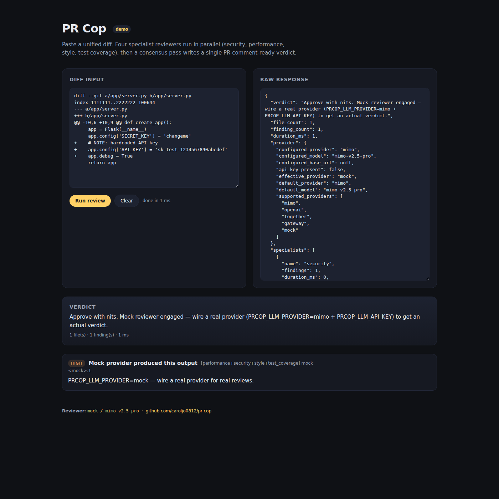

# PR Cop

Multi-agent code review squad. Four specialist reviewers run in parallel against
your diff (security, performance, style, test coverage), then a consensus pass
deduplicates findings and writes a single human verdict for the PR author.

PR Cop is meant to slot in next to a regular code review, not replace it. The
specialists are narrow on purpose: each one reads the same diff but only flags
things in its own focus area, which keeps signal-to-noise far higher than a
single generalist reviewer.



## What it does

Given a unified diff (file, stdin, local repo, or GitHub PR), PR Cop:

1. Parses the diff into per-file hunks with new-file line numbers.
2. Fans out to four specialist agents in parallel:
   - **security** — injection, auth, crypto, secrets, deserialization, SSRF, XSS, path traversal
   - **performance** — N+1 queries, blocking I/O on async paths, hot loops, big-O regressions
   - **style** — readability, naming, dead code, project conventions, type hints
   - **test_coverage** — missing tests, brittle assertions, mocked-too-much, untested error paths
3. Merges and deduplicates findings. When two specialists flag the same
   file+line+category the severity gets bumped one rung — agreement is signal.
4. Asks a consensus model to write a single PR-comment-ready verdict.

The result is available as text, GitHub-flavoured markdown (ready to paste into
a PR comment), or JSON.

## Reviewer model

The default reviewer model is `mimo-v2.5-pro` (Xiaomi MiMo v2.5 Pro). MiMo is
reasoning-strong and code-aware, which is what specialists need: read a
structured diff bundle, return a strict JSON list of issues with files, line
numbers, severities, and short explanations.

OpenAI, Together, and any OpenAI-compatible gateway are also supported via
`PRCOP_LLM_PROVIDER`. With no API key set, PR Cop falls back to a deterministic
mock provider so the pipeline stays runnable in CI and tests.

## Install

```bash
pip install -e .
# or with the dev extras
pip install -e ".[dev]"
```

Python 3.10+ is required.

## Configure

Copy `.env.example` to `.env` and fill in what you need:

```env
PRCOP_LLM_PROVIDER=mimo
PRCOP_LLM_API_KEY=your-key
PRCOP_LLM_MODEL=mimo-v2.5-pro

PRCOP_GITHUB_TOKEN=ghp_xxx   # only for posting PR comments
PRCOP_HOST=0.0.0.0
PRCOP_PORT=8080
PRCOP_CONCURRENCY=4
PRCOP_MAX_TOKENS=1200
```

## Use it

### CLI

Review a diff file:

```bash
prcop review --diff feature.diff
```

Review the diff between two refs in a local repo:

```bash
prcop review --repo . --base main --head feature/auth-fix
```

Review a GitHub PR and post the verdict back as a comment:

```bash
export PRCOP_GITHUB_TOKEN=ghp_xxx
prcop review-pr octocat/hello-world 42 --post-comment --markdown
```

Pipe a diff in:

```bash
git diff main..feature | prcop review --diff -
```

Inspect the active provider config:

```bash
prcop provider
```

### HTTP

Run the FastAPI server:

```bash
prcop serve            # PRCOP_HOST / PRCOP_PORT or defaults 0.0.0.0:8080
```

Endpoints:

- `GET  /` — service metadata + reviewer info
- `GET  /health` — liveness
- `GET  /provider` — active provider snapshot
- `POST /review/diff` — review a unified diff text body
- `POST /review/github` — review a GitHub PR (`{owner, repo, pr_number, post_comment?}`)
- `GET  /demo` — small static demo page

Example:

```bash
curl -s http://localhost:8080/review/diff \
  -H 'content-type: application/json' \
  -d "{\"diff\": $(jq -Rs . feature.diff)}" | jq .verdict
```

## Output shape

Every reviewer call returns this shape:

```json
{
  "verdict": "Approve with nits. ...",
  "file_count": 3,
  "finding_count": 5,
  "duration_ms": 4120,
  "provider": {
    "configured_provider": "mimo",
    "configured_model": "mimo-v2.5-pro",
    "effective_provider": "mimo",
    "...": "..."
  },
  "specialists": [
    {"name": "security", "findings": 2, "duration_ms": 980, "error": null},
    {"name": "performance", "findings": 1, "duration_ms": 1100, "error": null},
    {"name": "style", "findings": 1, "duration_ms": 870, "error": null},
    {"name": "test_coverage", "findings": 1, "duration_ms": 1020, "error": null}
  ],
  "findings": [
    {
      "specialist": "security",
      "file": "app/server.py",
      "line": 42,
      "severity": "high",
      "category": "hardcoded-secret",
      "title": "...",
      "rationale": "...",
      "suggestion": "..."
    }
  ]
}
```

## Tests

```bash
pip install -e ".[dev]"
PRCOP_LLM_PROVIDER=mock pytest -q
```

Tests run against the mock provider so they don't hit the network. CI runs the
same suite on Python 3.11 and 3.12.

## Layout

```
src/prcop/
  llm.py            # OpenAI-compatible chat client + JSON repair
  diff.py           # dependency-free unified-diff parser + renderer
  sources.py        # diff sources: text, file, local repo, GitHub PR
  specialists.py    # 4 specialist prompts + Finding shape + JSON contract
  consensus.py      # dedup, severity merge, verdict writer
  orchestrator.py   # parallel fan-out + report renderers
  server.py         # FastAPI app
  cli.py            # Click CLI
demo/index.html     # static demo page
tests/              # pytest suite
.github/workflows   # CI
```

## License

MIT — see [LICENSE](LICENSE).
